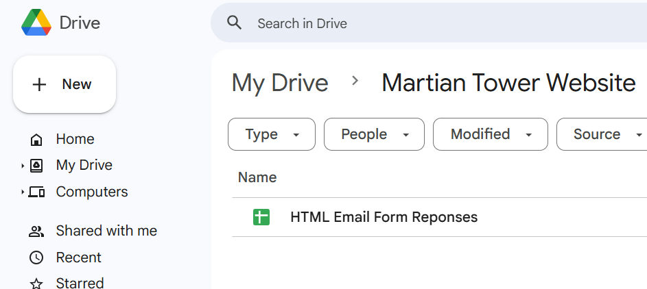
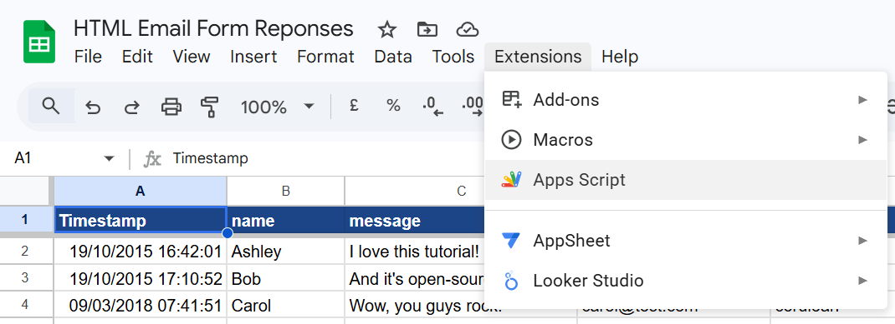
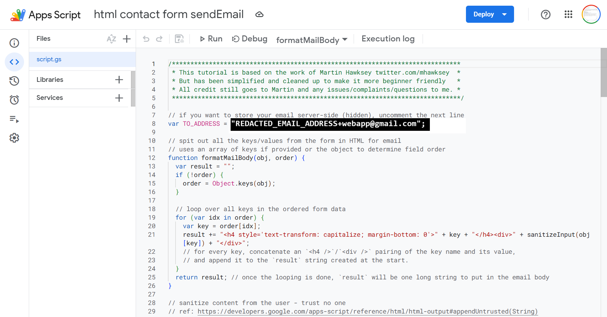

The mirror code you see here doesn't actually control anything directly.

But this website makes some calls to external google WebApps. I've copied the code that was deployed externally here to this mirror folder, so that you can have context on what's happening outside this project.

External Dependency: Contact Page Backend - Google Sheets 
==================================

## where the "Contact" Page's `script.gs` is located / How it was deployed (server side)

The backend for the "Contact" page is a google sheet believe it or not!


Google sheets lets you add "Apps Script" to the spreadsheet.


And then if you click on "Apps Script", it'll take you to where I have a little `.gs` script.

Gmail has a nice feature where you can throw in a `+whatever` into your gmail address, so if you notice, I used a `+webapp` for this [`script.gs`](./script.gs) so that I can easily filter email coming directly from my website's contact page.

You can see a full copy of my Apps Script in [`script.gs`](./script.gs).

If you want the original tutorial I followed to figure this out, check out: [WARNING: MAKE SURE TO FILL IN AN EMAIL ADDRESS IN THE SCRIPT BEFORE USING IT, OR ELSE YOU BECOME VULNERABLE TO PEOPLE SENDING EMAIL AS YOU!!!!! (click here for link to original tutorial)](https://github.com/dwyl/learn-to-send-email-via-google-script-html-no-server)

## How the `script.gs` is used (client side)

If you look in my [`index.html`](../index.html) in the code for the `<article id="contact">`, you find the following blurb:

```
<form class="gform" method="POST" action="https://script.google.com/macros/s/AKfycby2sB7UX-X1v3pMGrh360ROmUGFTlemdzjn4cavQIr7J3DxVvV6QE1mLIz3NkU15Q0xKg/exec">
```
 The HTML has a `<form>` tag, which lays out all the text box inputs on the website, and it is set to make an HTTP POST request to a special `script.google.com` URL. (you can find this special URL for your Apps Script by clicking on the "Deploy" button above the script editor, and clicking on "Manage Deployments". Full details in the original tutorial, linked above in server side docs)

 